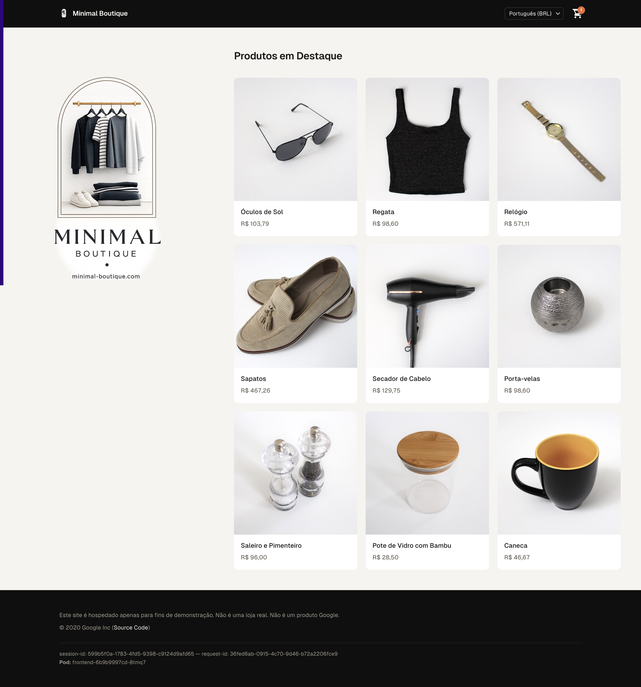
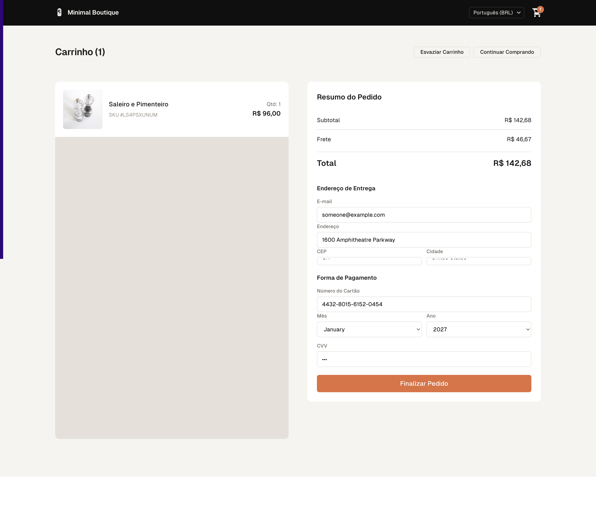

<p align="center">

</p>

<h1 align="center">Minimal Boutique</h1>

<p align="center">
  Fork brasileiro do <strong>Online Boutique</strong> — 11 microsserviços em 6 linguagens.<br>
  🇧🇷 pt-BR · R$ BRL · frontend redesenhado · <code>juniorjbn/*:v1.0.0</code>
</p>

<p align="center">
  <a href="https://hub.docker.com/u/juniorjbn"></a>
  
  
</p>

---

## Screenshots

| Home Page | Checkout Screen |
|-----------|-----------------|
|  |  |

Home page · Checkout screen — frontend redesenhado com locale pt-BR e moeda BRL.

---

## O que é esse app?

O **Online Boutique** é uma loja virtual fictícia criada pelo Google para demonstrar o modelo de **microsserviços**: em vez de um programa monolítico, o app é dividido em 11 serviços pequenos e autônomos, escritos em 6 linguagens diferentes, cada um com uma responsabilidade bem definida. Eles conversam entre si via **gRPC**.

Este fork customiza a loja para o público brasileiro:

- 🇧🇷 **Idioma:** site em português (pt-BR) com suporte a inglês (en)
- 💰 **Moeda:** BRL (Real) como padrão, formatação brasileira (R$ 1.234,56)
- 🎨 **Design:** frontend redesenhado com CSS Grid, fonte Geist, nav minimalista


---

## Os serviços

| Serviço | Linguagem | Descrição |
|---------|-----------|-----------|
| **frontend** | Go | Monta e serve a página da loja. Coordena todos os outros serviços. |
| **cartservice** | C# | Mantém o carrinho de compras do usuário. Usa Redis como armazenamento. |
| **productcatalogservice** | Go | Catálogo de produtos: nomes, preços, descrições e imagens. |
| **currencyservice** | Node.js | Converte valores entre moedas usando taxas do Banco Central Europeu. |
| **paymentservice** | Node.js | Processa pagamento com cartão de crédito (simulado). |
| **shippingservice** | Go | Calcula frete e simula envio do pedido. |
| **emailservice** | Python | Envia e-mail de confirmação (simulado — apenas log). |
| **checkoutservice** | Go | Orquestra a finalização da compra: carrinho, frete, pagamento, e-mail. |
| **recommendationservice** | Python | Sugere produtos com base no carrinho. |
| **adservice** | Java | Exibe anúncios de acordo com o contexto do produto. |
| **redis-cart** | Redis | Banco em memória que persiste os carrinhos de compra. |
| **loadgenerator** | Python/Locust | Simula centenas de usuários para testar resiliência. |

---

## Fluxo de uma requisição

Quando você abre a página inicial, o frontend orquestra as seguintes chamadas:

1. **Lista de moedas** → currencyservice
2. **Catálogo de produtos** → productcatalogservice
3. **Carrinho do usuário** → cartservice → Redis
4. **Conversão de preços** → currencyservice
5. **Anúncios** → adservice
6. **Renderiza o HTML final** → envia ao navegador

Ao finalizar a compra, o frontend chama o **checkoutservice**, que coordena o resto: busca o carrinho, calcula frete, processa o pagamento e envia o e-mail de confirmação.

---

## Deploy rápido (Kind + Docker Hub)

**Pré-requisitos:** [Kind](https://kind.sigs.k8s.io), [Helm](https://helm.sh) v3.8+, Docker.

```bash
# Login no Docker Hub (imagens + Helm chart OCI)
docker login
helm registry login registry-1.docker.io --username juniorjbn

# Criar cluster Kind
kind create cluster --name onlineboutique

# Deploy via Helm (chart do Docker Hub OCI)
./deploy.sh

# Acompanhar os pods
kubectl get pods -n onlineboutique -w

# Acessar (port-forward — Kind não tem LoadBalancer)
kubectl port-forward -n onlineboutique svc/frontend 8080:80

# Abra http://localhost:8080
```

## Build e push das imagens + chart

```bash
# Buildar todas as imagens e fazer push
./build.sh

# Publicar o Helm chart no Docker Hub (OCI)
./publish-chart.sh
```

## Comandos úteis

```bash
kubectl get pods -n onlineboutique
kubectl logs -n onlineboutique deployment/frontend
kubectl port-forward -n onlineboutique svc/frontend 8080:80

# Remover tudo
helm uninstall onlineboutique -n onlineboutique
kubectl delete namespace onlineboutique
```

## Deploy sem Helm (kubectl direto)

```bash
kubectl apply -f kubernetes-manifests/
kubectl get pods
```

---

## Features

- **Kubernetes/GKE:** roda em qualquer cluster Kubernetes.
- **gRPC:** microsserviços se comunicam via gRPC.
- **Istio:** funciona com service mesh Istio.
- **Cloud Operations:** instrumentado com Profiling e Tracing.
- **Synthetic Load:** load generator com Locust para simular tráfego real.

## Desenvolvimento

Veja o [Guia de Desenvolvimento](docs/development-guide.md).

---

<p align="center">
  <a href="https://github.com/juniorjbn/microservices-demo">github.com/juniorjbn/microservices-demo</a>
  ·
  <a href="https://github.com/GoogleCloudPlatform/microservices-demo">original (GoogleCloudPlatform)</a>
</p>
